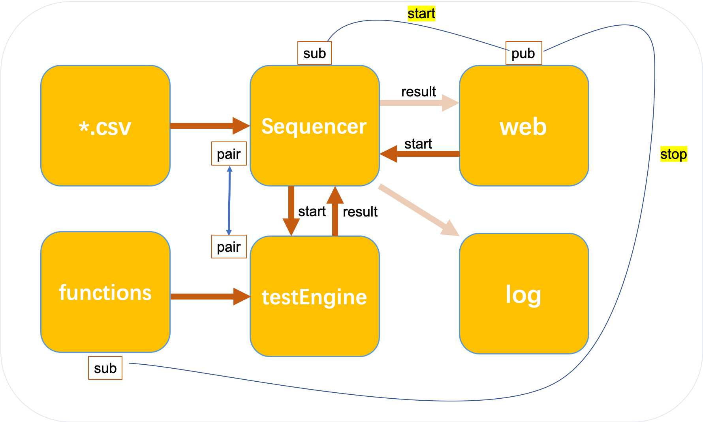
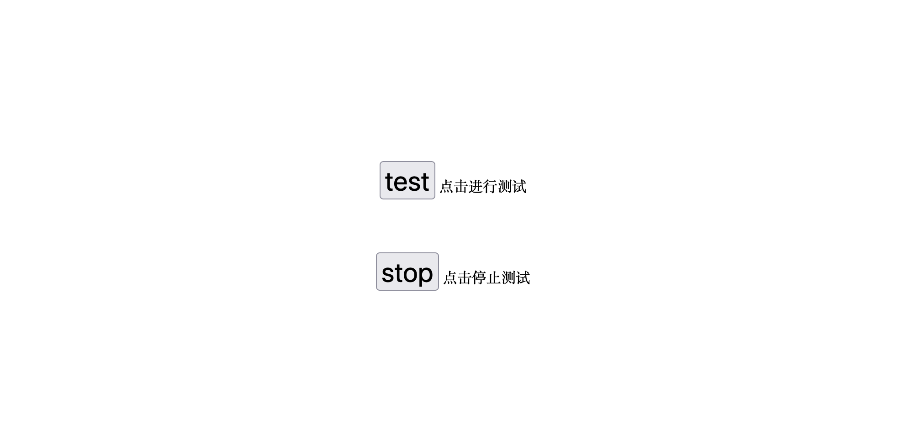

# TM

TM demo

We only run the web.py and main.py

You write down names of functions in the test_plan.csv

click the 'test' to run test, you can click 'stop' button to stop running program of tests.